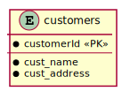

# Simple SQL Exercise

In this exercise, learners/lecturers will write queries that create a database and a simple table in that database. Learners will then test their queries by pushing them to their GitHub repo and checking the output from automated tests.

## Exercise 1

1. Using the `create-database.sql` file, write a query that creates a database called `SimpleDB`.

1. Still using `create-database.sql`, add a query that creates a table in `SimpleDB` called `customers`, that has attributes for customer name and address.

    

1. Push your changes back to your assignment GitHub repo. Remember to try to make your commits atomic and your commit messages descriptive.

1. Check either the [Actions](/actions) tab or classroom [Assignments](https://classroom.github.com/classrooms/38383355-sandbox-classroom/assignments/simple-sql-exercise-redux2) tab to see if you have completed the exercise successfully. You should score full marks if all tests have passed.

 

## References
